<p align="center">
  
</p>

<p align="center">
  <a href="https://nipunrautela.me"></a>
  <a href="https://www.linkedin.com/in/nipunrautela/"></a>
  <a href="https://leetcode.com/u/nipunrautela/"></a>
  <a href="https://stackoverflow.com/users/13910633/nipun"></a>
  <a href="mailto:rautelanipun@gmail.com"></a>
</p>

---

## `//` Driver profile

Software engineer working on **distributed systems that cannot go down**. Currently at
**Visa**, taking an Ansible automation orchestration platform apart — out of a large
Activiti BPMN and polling-based monolith, into segregated event-driven processors on
custom self-healing active-active Hazelcast queues.

The interesting part is never the new architecture. It is getting there without an
outage: reconstructing the state of every in-flight execution and parking it until the
new processors are ready to pick it up, so the cutover is invisible to everyone using
the platform.

Before that, nearly two years at **Societe Generale Global Solution Centre** moving a
regulated on-premise estate onto Azure and rebuilding the CI/CD and database jobs
underneath it.

```console
$ whoami --verbose
name        Nipun Rautela
role        Software Engineer @ Visa
based       Bangalore, India
focus       Event-driven architecture · Multi-region · Self-healing queues
education   B.Tech CSE, VIT — CGPA 8.99
resume      https://nipunrautela.me/nipunrautela_resume.pdf
```

---

## `//` Track record

<p align="center">
  
</p>

---

## `//` Race history

| Season | Team | Seat | What I ran |
| :--- | :--- | :--- | :--- |
| **Oct 2025 —** | **Visa** | Software Engineer | Monolith → event-driven processors on self-healing active-active Hazelcast queues. Zero-downtime cutover via a parking-lot system with full state reconstruction. Token-bucket rate limiter, annotation-enforced and API-overridable. Cross-region dual-DC job scheduler replacing a misfire-prone Quartz setup. |
| **Feb 2024 – Oct 2025** | **Societe Generale GSC** | Software Engineer | On-prem → Azure (AKS, Azure PostgreSQL, DNS, certificates, Key Vault) with automated provisioning. Blue-green AKS migration automated end to end. Docker registry Mirantis → Harbor, artifacts Nexus → JFrog, CI Jenkins → GitHub Actions. Nightly database job 5.5h → 3h. VBA → Python cloud functions at 70% test coverage. |
| **May 2023 – Jul 2023** | **TVS Motor Company** | Data Scientist Intern | Automated 90% of accessories sales and under-performing dealer analysis — cleaning cronjob feeding a Power BI dashboard. Fine-tuned a YOLOv8 accessory recognition model, +3% accuracy. |
| **Apr 2023 – Jun 2023** | **Inxtinct Security** | Full Stack Developer | Email security browser plugin doing intent and threat analysis with prompt-engineered GPT-4 calls. Ported vanilla JS → React + TypeScript + Webpack, cutting subsequent dev time by 40%+. |

---

## `//` The garage

<p align="center">
  
  <br>
  
</p>

| Bay | Kit |
| :--- | :--- |
| **Languages** | Java · Python · C++ · TypeScript · JavaScript · SQL · Bash |
| **Frameworks** | Spring Boot · FastAPI · Express.js · React · Angular · Activiti BPMN · Quartz · Astro |
| **Distributed systems** | Event-driven architecture · Active-active · Multi-region · Self-healing queues · Rate limiting · Job scheduling |
| **Cloud & infra** | Azure · AKS · Azure Key Vault · Kubernetes · Docker · Ansible (AWX) · Harbor |
| **Data & caching** | PostgreSQL · MySQL · ClickHouse · Hazelcast · Ehcache · Power BI |
| **Build, test & observability** | Git · Maven · Jenkins · GitHub Actions · JFrog · JUnit 5 · Grafana · uv · Linux |
| **AI engineering** | Model Context Protocol · LLM SDKs · A2A |

---

## `//` Starting grid

| Project | What it is | Built with |
| :--- | :--- | :--- |
| **[KoDS Bot](https://github.com/nipunrautela/KoDS-Bot)** | Discord bot running an RPG-style guild of 300+ members — profiles, inventory, reputation, moderation. Item transfers are atomic: the read-modify-write lives in a single database operation, so two simultaneous trades can never duplicate an item. | Python · discord.py · MongoDB |
| **[Graph Visualizer](https://github.com/nipunrautela/graph-visualizer)** | Watches traversal and pathfinding algorithms run step by step. Each algorithm is a generator yielding state after every meaningful operation; the renderer just draws whatever state is current. | Python · Algorithms |
| **[What's On My Plate](https://github.com/nipunrautela/whatsonmyplate)** | Turns whatever is left in your fridge into things you can actually cook. Ranking weights matches by how central each missing ingredient is — "almost makeable" beats "exactly makeable" when the gap is salt, not saffron. | JavaScript · REST API |
| **[Sparks Bank](https://github.com/nipunrautela/sparks-bank)** | Banking front-end with account management, transfers and a ledger. Append-only: a corrected transaction produces a reversing entry rather than editing history. | JavaScript · Bootstrap |
| **[Weather App](https://github.com/nipunrautela/weatherappflutter)** | Location-aware forecasts in a layout that adapts to conditions — the palette shifts so a storm and a clear afternoon don't look identical at a glance. | Flutter · Dart · REST API |
| **[nipunrautela.me](https://github.com/nipunrautela/nipunrautela.github.io)** | This portfolio — content-collection driven, statically built, deployed on GitHub Actions. | Astro · TypeScript |

Also in the pit lane: **[solution-shed](https://github.com/nipunrautela/solution-shed)** (Java idea-submission platform),
**[dsa](https://github.com/nipunrautela/dsa)** and **[tle-eliminator-cp31](https://github.com/nipunrautela/tle-eliminator-cp31)** (C++ practice, ongoing).

---

## `//` Telemetry

<p align="center">
  
  
</p>

---

## `//` From the notebook

- **[Cutting a nightly job from 5.5 hours to 3](https://nipunrautela.me/blog/parallelizing-a-nightly-database-job/)** — what I learned parallelizing a pl/pgsql and C-shell batch pipeline that had quietly grown past its window.
- **[/now](https://nipunrautela.me/now/)** — what has my attention at the moment.
- **[/uses](https://nipunrautela.me/uses/)** — the tools I actually reach for.

---

## `//` Pit wall

I'm happy where I am, but the door stays open. If you're working on genuinely distributed
problems — the kind where failure modes matter more than benchmarks — I'm glad to talk.

<p align="center">
  <a href="mailto:rautelanipun@gmail.com"></a>
  <a href="https://nipunrautela.me/nipunrautela_resume.pdf"></a>
</p>

<p align="center">
  <sub><code>// built to stay online through change</code></sub>
</p>
