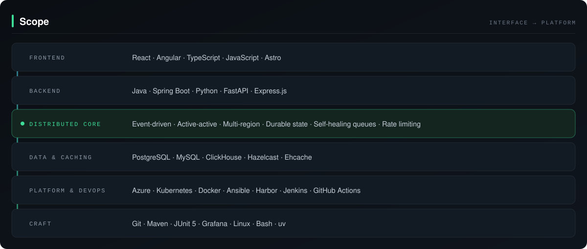

  

  
  
  
  
  

---

## `//` About

Software engineer working on large scale, multi-region, durable distributed systems.

I build across the full stack rather than one slice of it: services on the backend, interfaces on the front, the data and caching underneath, and the platform and pipelines it all runs on. The through line is systems that hold their guarantees when something fails, because failure modes matter more than benchmarks.

Comfortable owning a feature from schema to deploy, and comfortable going deep on the parts that have to survive a bad night.

## `//` Scope

  

<b>Full breakdown</b>

 

| Layer | Kit |
| :--- | :--- |
| **Languages** | Java, Python, C++, TypeScript, JavaScript, SQL, Bash |
| **Frontend** | React, Angular, Astro |
| **Backend** | Spring Boot, FastAPI, Express.js, Activiti BPMN, Quartz |
| **Distributed** | Event-driven architecture, active-active, multi-region, durable state, self-healing queues, rate limiting, job scheduling |
| **Data & caching** | PostgreSQL, MySQL, ClickHouse, Hazelcast, Ehcache |
| **Cloud & infra** | Azure, AKS, Key Vault, Kubernetes, Docker, Ansible (AWX), Harbor |
| **CI/CD & tooling** | Git, Maven, Jenkins, GitHub Actions, JFrog, JUnit 5, Grafana, Linux, uv |
| **AI engineering** | Model Context Protocol, LLM SDKs, A2A |

  
   
  

## `//` Stats

  
  

## `//` Elsewhere

Repositories worth a look: [solution-shed](https://github.com/nipunrautela/solution-shed), [KoDS-Bot](https://github.com/nipunrautela/KoDS-Bot), [graph-visualizer](https://github.com/nipunrautela/graph-visualizer), [dsa](https://github.com/nipunrautela/dsa), [nipunrautela.github.io](https://github.com/nipunrautela/nipunrautela.github.io).

Longer form writing and what I am working on now live at **[nipunrautela.me](https://nipunrautela.me)**.

  
  

  <code>// built to stay online through change</code>

